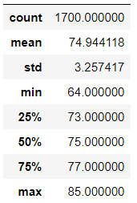
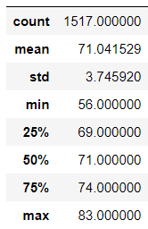
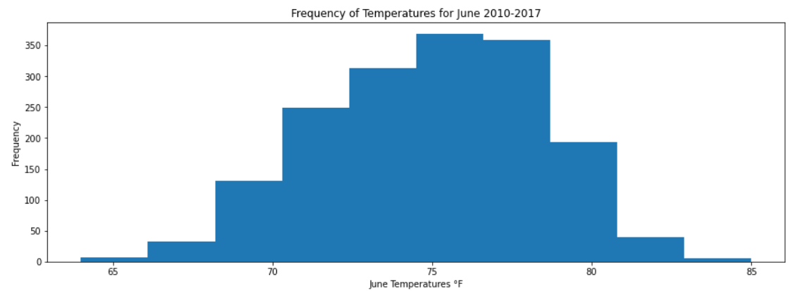
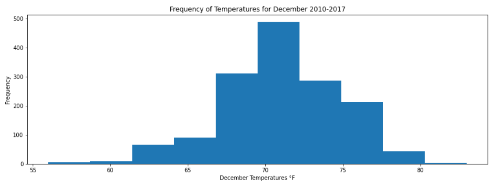
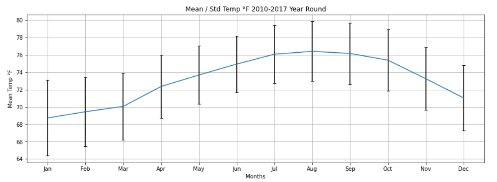
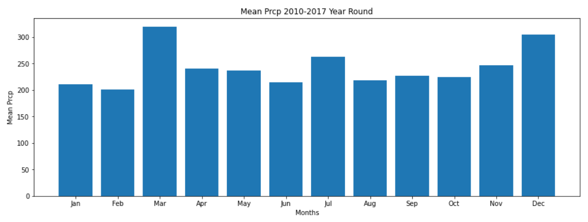

# Surfs Up

## Overview
In this project we explore the temperature data for the months of June and December in Oahu, in order to determine if a surf and ice cream shop business is sustainable year-round.

## Results
Assuming that the months of June and December as the most representative months of summer and winter, we can observe the following:
|June Temp. Statistics |December Temp. Statistics|
:---------------------:|:------------------------:
     | 
| 

* The mean an quintiles are all bigger for the month of June than for December. This is consistent with the expected comparison between summer and winter.
* On the other side, if we exclude the minimum temperature, the difference between both is not that much, only 3 to 4 degrees, which tells us that if the June temperatures are good enough for surf and ice cream, so are the Decemeber temperatures. 
* Finally, the temperatures on December concetrate more towards the center, but has a slighty bigger range of temperatures making it a little bit more variable.

## Summary
* Based on the previous analysis we can say that the season around June until December should have good temperatures for the Surf and Ice Crema shop.
* In order to have more information about the best months for the Surf and Ice Cream shop, we should analyse the whole year and plot the error plot. We can see that temperature wise, the best months are from April to December, being both of them very similar.

* Another important point we should consider is the amount of precipitation. We can observe that the months of March and December are the rainiest. So considering both, temperature and precipitations, April to November seems to be the best choice to havethe sop open.

